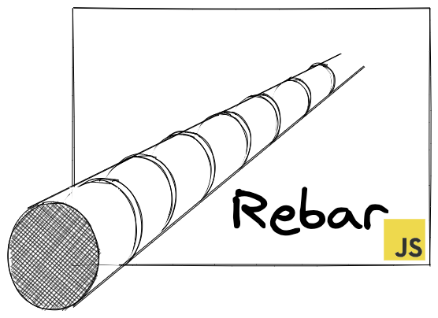

# Rebarjs
A rapid user interface construction toolkit for JSON REST APIs that builds upon
existing standards and frameworks. The first Javascript UI framework supported
is Vue/Nuxt. Contributions to add React/Next, Angular, and others are welcome
and encouraged!

## Goals
* To use all available information about a JSON endpoint to produce a user interface for that endpoint.
  The information used to inform the creation of the user interface includes and isn't limited to:
  * JSON Schema
  * JSON-LD Contexts
  * OpenAPI or Swagger documents
* To enable UI configurations to be shared across the entire application.
* To make it easy to combine, extend, and override configurations.

## Build Setup

```bash
# install dependencies
$ yarn install

# serve with hot reload at localhost:3000
$ yarn dev

# build for production and launch server
$ yarn build
$ yarn start

# generate static project
$ yarn generate

# run storybook
$ yarn nuxt storybook
```

For detailed explanation on how things work, check out [Nuxt.js docs](https://nuxtjs.org).

## Conda Environment Notes

A specific version of `openssl=1.1.1l` is specified to avoid an [issue with openssl 3.0](https://stackoverflow.com/questions/69692842/error0308010cdigital-envelope-routinesunsupported)